# iLearn FCU Sitemap

根據 https://ilearn.fcu.edu.tw 的首頁與公開連結整理。

```mermaid
graph TD
    A[iLearn FCU 首頁] --> B[登入]
    A --> C[切換英文版]
    A --> D[常見問題]
    A --> E[聯絡我們]
    A --> F[取得行動應用程式]
    A --> G[學習資源 / 課程導覽]
    A --> H[Q&A]
    A --> I[智慧財產權政策]

    D --> D1[FAQ 1<br/>如何看到全部課程的最新公告資訊]
    D --> D2[FAQ 2<br/>課程預警時間截止後退選的確認作業]

    F --> F1[Android - Google Play]
    F --> F2[iOS - App Store]
    F --> F3[Moodle Mobile 下載頁]

    G --> G1[教師篇]
    G --> G2[學生篇]
    G --> G3[新進教師工作坊]
    G --> G4[操作指引]
    G --> G5[教務資料下載]
    G --> G6[校園智慧財產權宣導]

    H --> H1[Q&A 彙整]

    E --> E1[支援信箱 / 聯絡頁]
    I --> I1[尊重及保護智慧財產權]

    A --> J[首頁課程捷徑]
    J --> J1[教師篇]
    J --> J2[學生篇]
    J --> J3[新進教師工作坊]
    J --> J4[操作指引]
    J --> J5[教務資料下載]
    J --> J6[校園智慧財產權宣導]
    J --> J7[Q&A 彙整]
```

## Source Notes
- 首頁公開連結包含登入、英文版、聯絡我們、行動應用程式、智慧財產權政策。
- 首頁左側/展開式導覽包含教師篇、學生篇、新進教師工作坊、操作指引、教務資料下載、校園智慧財產權宣導，以及 Q&A 彙整。
- 首頁 FAQ 區塊目前可見 2 個問題。
